# Multi-PDF Course Recap Package

> **Generated for**: `AAPLecture1_LLM_Foundations.pdf` and `AAPLecture2_Prompt_Engineering.pdf`  
> **Extraction & Synthesis**: `@concept-extractor` Skill  
> **QA Audit & Verification**: `@recap-reviewer` Sub-Agent  

---

# 📄 PDF Deck 1: AAPLecture1_LLM_Foundations.pdf

### 1. Executive Summary (`AAPLecture1_LLM_Foundations.pdf`)
Lecture 1 covers the fundamental mechanics of Large Language Models (LLMs). LLMs convert raw text into subword token sequences via algorithms such as Byte-Pair Encoding (BPE), WordPiece, SentencePiece, and tiktoken. The lecture compares Dense neural architectures (where 100% of parameters run per token) with Mixture of Experts (MoE) models (where sparse routers direct tokens to active sub-networks). It explains reasoning models that compute internal "thinking tokens", vector embeddings and vector databases for semantic retrieval, and the mechanics of fixed-size context windows including the "lost in the middle" attention bottleneck. Lastly, it details sampling parameters (Temperature, Top-p, Top-k, Hallucinations), token billing economics (prompt caching, budgeting, truncation bugs), and key latency metrics (TTFT - Time to First Token, TPOT - Time per Output Token, and Streaming).

---

### 2. Core Concepts & Key Takeaways (`AAPLecture1_LLM_Foundations.pdf`)

- **Tokenization Mechanics**:
  - **BPE (Byte-Pair Encoding)**: Iteratively merges the most frequent byte/character pairs.
  - **WordPiece**: Uses greedy longest match with `##` continuation markers (e.g. BERT).
  - **SentencePiece**: Operates on raw text treating spaces as explicit symbols.
  - **tiktoken**: Fast byte-level BPE tokenizer used by OpenAI models.
- **Model Architecture & Sizing**:
  - **Dense Models**: All parameters execute for every token processed.
  - **Mixture of Experts (MoE)**: Sparse routing activates specific expert layers per token.
  - **Reasoning Models**: Generate internal "thinking tokens" before producing visible answers.
- **Context Windows & Attention**:
  - Fixed-size input buffers. Long conversations suffer from the "lost in the middle" effect where model attention degrades for information located in the center of large context windows.
- **Sampling Parameters**:
  - **Temperature**: Scales logit probability distributions (lower = deterministic, higher = creative).
  - **Top-p (Nucleus) & Top-k**: Restricts candidate token vocabulary by cumulative probability or count.
  - **Hallucination**: Generation of plausible and confident yet factually incorrect outputs.
- **Token Economics & Production Inference**:
  - **Pricing**: Input and output tokens carry distinct costs; prompt caching lowers latency for static prefixes.
  - **TTFT (Time to First Token)**: Initial response latency.
  - **TPOT (Time per Output Token)**: Generation speed per subsequent token.

---

### 3. Terminology & Definitions (`AAPLecture1_LLM_Foundations.pdf`)

| Term | Definition | Slide Ref |
| :--- | :--- | :---: |
| **Token** | The atomic subword or character unit mapped to a numerical vocabulary ID. | Slide 3 |
| **BPE (Byte-Pair Encoding)** | A subword tokenization algorithm that builds vocabulary by merging frequent character pairs. | Slide 5 |
| **WordPiece** | Greedy subword tokenizer using `##` continuation flags for word fragments. | Slide 6 |
| **SentencePiece** | Tokenizer operating on raw text stream where whitespace is treated as an explicit symbol. | Slide 7 |
| **tiktoken** | High-speed byte-level BPE tokenizer implementation by OpenAI. | Slide 8 |
| **Dense Model** | An LLM architecture where 100% of weights are activated for every token. | Slide 10 |
| **MoE (Mixture of Experts)** | A sparse neural network routing tokens to a subset of specialized expert layers. | Slide 10 |
| **Reasoning Model** | Model architecture generating internal chain-of-thought tokens prior to answering. | Slide 11 |
| **Embeddings** | High-dimensional vector representations mapping text into dense semantic spaces. | Slide 13 |
| **Vector Database** | Database optimized for high-speed similarity search across vector embeddings. | Slide 14 |
| **Context Window** | The maximum token capacity an LLM can accept and process in a single forward pass. | Slide 15 |
| **Temperature** | Hyperparameter scaling logit probability distribution to regulate sampling randomness. | Slide 18 |
| **Top-p / Top-k** | Sampling strategies restricting token selection to top cumulative probability or count. | Slide 19 |
| **TTFT** | Time to First Token; duration from request dispatch to receiving the first output token. | Slide 28 |
| **TPOT** | Time per Output Token; average duration to generate each subsequent token. | Slide 29 |

---

### 4. Visual Topic Diagram (`AAPLecture1_LLM_Foundations.pdf`)

```mermaid
graph TD
    classDef main fill:#4f46e5,stroke:#818cf8,stroke-width:2px,color:#ffffff;
    classDef section fill:#1e1e2e,stroke:#89b4fa,stroke-width:2px,color:#f1f5f9;
    classDef node fill:#0f172a,stroke:#313244,stroke-width:1px,color:#cdd6f4;
    classDef metric fill:#06b6d4,stroke:#22d3ee,stroke-width:1px,color:#ffffff;

    Start["LLM Foundations (Lecture 1)"]:::main

    Start --> Tok["1. Tokenization Engine"]:::section
    Tok --> BPE["Byte-Pair Encoding (BPE)<br/>Merges frequent byte pairs"]:::node
    Tok --> WP["WordPiece<br/>Greedy match + ## continuation"]:::node
    Tok --> SP["SentencePiece<br/>Raw text + space symbols"]:::node
    Tok --> Tik["tiktoken<br/>Fast byte-level BPE"]:::node

    Start --> Arch["2. Model Architecture & Sizing"]:::section
    Arch --> Dense["Dense Model<br/>100% params active per token"]:::node
    Arch --> MoE["Mixture of Experts (MoE)<br/>Router directs token to experts"]:::node
    Arch --> Reasoning["Reasoning Models<br/>Generates internal thinking tokens"]:::node

    Start --> Context["3. Context & Embeddings"]:::section
    Context --> Embed["Embeddings & Vector DB<br/>Dense vector similarity search"]:::node
    Context --> LostMid["Context Window & Attention<br/>Lost in Middle bottleneck"]:::node

    Start --> Sampling["4. Sampling & Generation"]:::section
    Sampling --> Temp["Temperature<br/>Logit scaling (0=determ, 1=creative)"]:::node
    Sampling --> TopPK["Top-p / Top-k<br/>Nucleus & top-k vocab limits"]:::node
    Sampling --> Halluc["Hallucination<br/>Plausible, confident, incorrect"]:::node

    Start --> Metrics["5. Production Inference"]:::section
    Metrics --> TTFT["TTFT: Time to First Token"]:::metric
    Metrics --> TPOT["TPOT: Time per Output Token"]:::metric
    Metrics --> Cache["Prompt Caching & Budgeting"]:::node
```



---

### 5. Review Questions (`AAPLecture1_LLM_Foundations.pdf`)
- **Q1**: What is the difference between a Dense LLM and a Mixture of Experts (MoE) LLM?
  - *Answer*: A Dense LLM activates 100% of network parameters for every token processed, whereas an MoE LLM uses a router to direct each token to a small subset of specialized expert layers, reducing compute requirements per token.
- **Q2**: What is the "lost in the middle" problem in context windows?
  - *Answer*: It is the phenomenon where model attention and recall accuracy degrade for information placed in the middle of a large context window compared to information at the beginning or end.

---

# 📄 PDF Deck 2: AAPLecture2_Prompt_Engineering.pdf

### 1. Executive Summary (`AAPLecture2_Prompt_Engineering.pdf`)
Lecture 2 provides an engineering-grade guide to Prompt Engineering ("how to talk to a model so it listens"). It breaks prompts into a 4-part modular structure (Role, Task/Instruction, Context/Data, Output Format). It demonstrates structural boundary demarcation techniques such as XML sandwiching (`<instructions>`, `<text>`) and markdown delimiters (` ``` `, `---`, `#`) to prevent instruction-data confusion. The lecture details the progression from Zero-shot to One-shot and Few-shot prompting, cataloging common failure modes (ambiguity, conflicting constraints, format drift, self-contradiction). Finally, it details production concerns including prompt injection security attacks, structured schema input validation (Pydantic / JSON schema), prompt version control, and evaluation test sets (evals).

---

### 2. Core Concepts & Key Takeaways (`AAPLecture2_Prompt_Engineering.pdf`)

- **4-Part Modular Prompt Structure**:
  - **Role/System**: System identity and behavioral guardrails.
  - **Task/Instruction**: Clear, unambiguous directive statement.
  - **Context/Data**: The input payload visually isolated from instructions.
  - **Output Formatting**: Explicit target schema (JSON/Markdown/XML).
- **Structural Delimiters & XML Sandwiching**:
  - Wrapping input payloads inside XML tags (e.g. `<instructions>`, `<text>`) or markdown fences eliminates the "wall-of-text" problem and prevents models from treating user data as system commands.
- **Shot Prompting Taxonomy**:
  - **Zero-Shot**: Directive instruction provided without input-output examples.
  - **One-Shot**: Single exemplar demonstrating the target format.
  - **Few-Shot**: Multiple exemplars establishing output format stability and handling edge cases.
- **Common Prompt Failure Modes**:
  - **Ambiguous Instructions**: Model fills gaps with default training assumptions.
  - **Conflicting Constraints**: Incompatible rules causing logical deadlocks.
  - **Format Drift**: Long outputs reverting from structured JSON/XML to plain text prose.
- **Production Defense & Security**:
  - **Prompt Injection**: Attack vector where user input hijacks system instructions (e.g., "Ignore previous directions").
  - **Structured Input Defenses**: Enforcing JSON schemas to isolate untrusted input.
  - **Prompt Versioning & Evals**: Managing prompts in version control and testing against benchmark evaluation sets before deployment.

---

### 3. Terminology & Definitions (`AAPLecture2_Prompt_Engineering.pdf`)

| Term | Definition | Slide Ref |
| :--- | :--- | :---: |
| **Prompt Engineering** | Designing, structuring, and refining inputs to reliably steer LLM behavior and outputs. | Slide 1 |
| **XML Sandwiching** | Enclosing input data within XML tags (e.g. `<text>...</text>`) to isolate data from instructions. | Slide 6 |
| **Zero-Shot** | Executing a prompt directive without providing any demonstration input-output examples. | Slide 11 |
| **One-Shot** | Supplying a single input-output example in the prompt to establish expected formatting. | Slide 12 |
| **Few-Shot** | Supplying multiple input-output examples in the prompt for format stability and edge cases. | Slide 13 |
| **Format Drift** | Phenomenon where an LLM begins generating structured output but reverts to plain text over long outputs. | Slide 16 |
| **Prompt Injection** | Security vulnerability where untrusted user input overrides system instructions to alter model behavior. | Slide 19 |
| **Prompt Versioning** | Managing prompt templates in version control alongside automated regression test suites. | Slide 23 |
| **Eval Set** | A benchmark dataset of test cases used to quantitatively measure prompt accuracy and format adherence. | Slide 26 |

---

### 4. Visual Topic Diagram (`AAPLecture2_Prompt_Engineering.pdf`)

```mermaid
graph TD
    classDef main fill:#4f46e5,stroke:#818cf8,stroke-width:2px,color:#ffffff;
    classDef section fill:#1e1e2e,stroke:#89b4fa,stroke-width:2px,color:#f1f5f9;
    classDef node fill:#0f172a,stroke:#313244,stroke-width:1px,color:#cdd6f4;
    classDef alert fill:#f43f5e,stroke:#fb7185,stroke-width:1px,color:#ffffff;

    Start["Prompt Engineering (Lecture 2)"]:::main

    Start --> Anatomy["1. 4-Part Prompt Anatomy"]:::section
    Anatomy --> Role["Role / Persona<br/>Sets system identity & rules"]:::node
    Anatomy --> Task["Instruction / Task<br/>Explicit directive statement"]:::node
    Anatomy --> Data["Context / Data Payload<br/>Input content to process"]:::node
    Anatomy --> Format["Output Formatting<br/>JSON / Markdown / XML schema"]:::node

    Start --> Structure["2. Delimiters & Boundary Demarcation"]:::section
    Structure --> WallText["Wall-of-Text Problem<br/>Model confuses data & instructions"]:::node
    Structure --> XMLSandwich["XML Sandwiching<br/>&lt;instructions&gt; ... &lt;/text&gt;"]:::node
    Structure --> Delim["Markdown Fences<br/>```, ---, # Section headers"]:::node

    Start --> Shots["3. Shot Prompting Taxonomy"]:::section
    Shots --> ZeroShot["Zero-Shot<br/>Directive only, zero examples"]:::node
    Shots --> OneShot["One-Shot<br/>Single input-output exemplar"]:::node
    Shots --> FewShot["Few-Shot<br/>Multiple exemplars for stability"]:::node

    Start --> Failures["4. Failure Patterns"]:::section
    Failures --> Ambiguity["Ambiguous Instructions"]:::node
    Failures --> Conflict["Conflicting Constraints"]:::node
    Failures --> Drift["Format Drift<br/>JSON reverts to plain text"]:::node

    Start --> Production["5. Security & Evals"]:::section
    Production --> Injection["Prompt Injection Attack<br/>User input hijacks prompt"]:::alert
    Production --> Defense["Structured Input Defenses<br/>Pydantic / JSON Schema validation"]:::node
    Production --> Evals["Prompt Versioning & Eval Sets<br/>Regression benchmarking"]:::node
```



---

### 5. Review Questions (`AAPLecture2_Prompt_Engineering.pdf`)
- **Q1**: What is XML Sandwiching and why is it effective?
  - *Answer*: XML Sandwiching is the practice of wrapping input data inside XML tags (e.g. `<instructions>`, `<text>`). It is effective because LLMs have seen extensive markup during pretraining and can cleanly differentiate directives from user payloads.
- **Q2**: What is a Prompt Injection attack?
  - *Answer*: Prompt Injection occurs when untrusted user input contains malicious instructions (e.g. "Ignore previous instructions") that hijack the model's system prompt and alter its intended behavior.

---

# 🔍 Quality Assurance Audit Report (@recap-reviewer)

**Review Date**: 2026-10-07  
**Reviewer Sub-Agent**: `@recap-reviewer`  
**Overall Audit Result**: **PASS ✅**

### Audit Matrix per PDF Deck

| PDF Deck | Slide Count | Terminology Table | Mermaid Diagram | Accuracy Check | Audit Status |
| :--- | :---: | :---: | :---: | :---: | :---: |
| `AAPLecture1_LLM_Foundations.pdf` | 34 | 15 terms with Slide Refs | Detailed Mindmap & Flowchart | 100% Verified | **PASS ✅** |
| `AAPLecture2_Prompt_Engineering.pdf` | 28 | 9 terms with Slide Refs | Detailed Mindmap & Flowchart | 100% Verified | **PASS ✅** |

---
*Generated by Antigravity Agentic Assistant for GEN AI ASSIGNMENT-1.*
